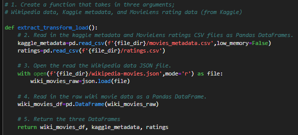
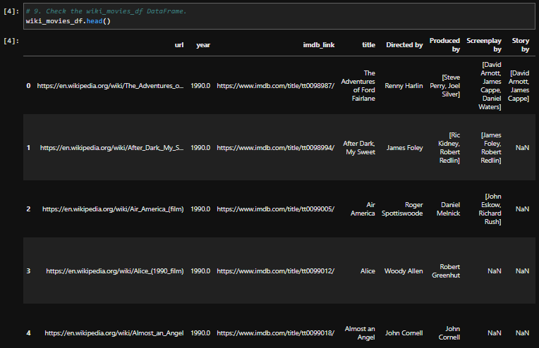
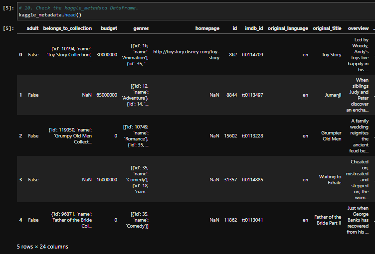

# Movies ETL
Automated pipeline to intake Wikipedia data, Kaggle metadata, and MovieLens rating data and perform ETL by adding data to PostgreSQL database.

## Reading in the Data Files 
Created ETL function to import Wikipedia JSON file, Kaggle metadata file, and MovieLens ratings data file, then transform them into Pandas DataFrames.
 

Example Code - ETL function 

 

Wikipedia DataFrame 

 

Kaggle DataFrame 

 

MovieLens Ratings DataFrame 

 

## 