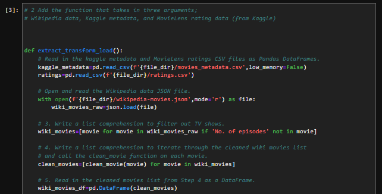
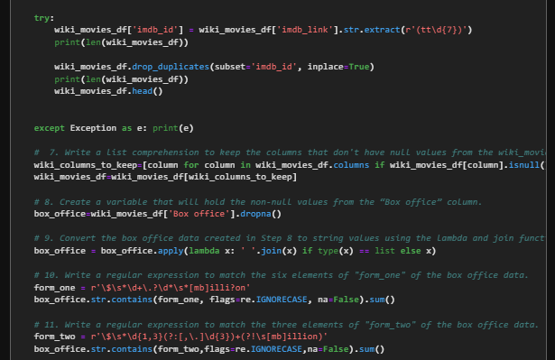
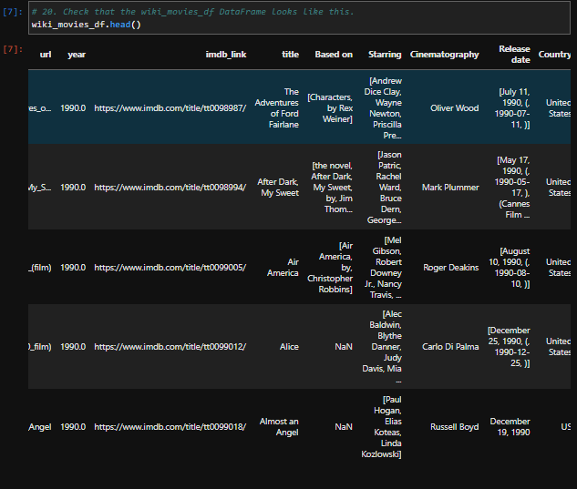
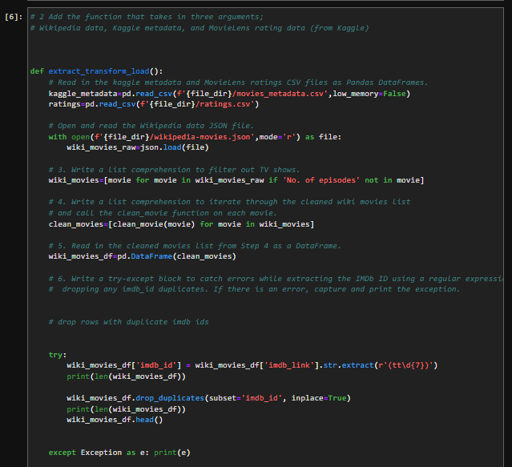
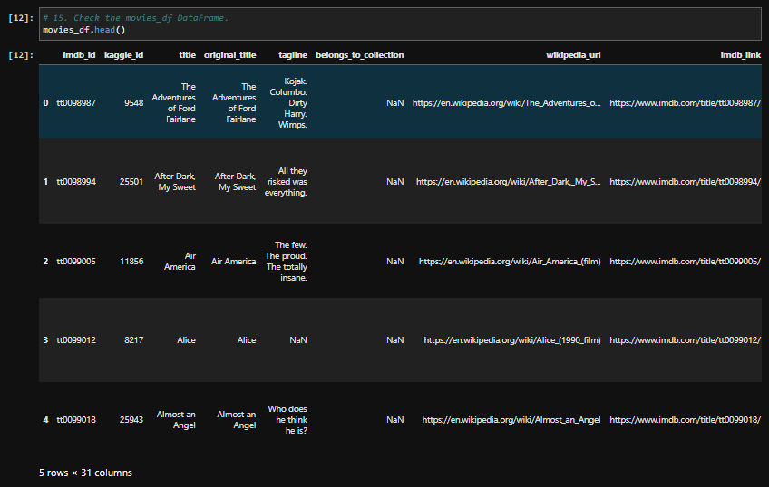
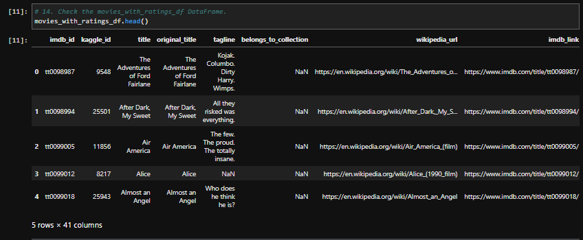
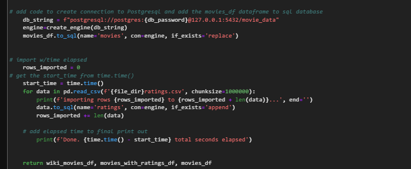

# Movies ETL
Automated pipeline to intake Wikipedia data, Kaggle metadata, and MovieLens rating data and perform ETL by adding data to PostgreSQL database.

## Write ETL Function to Read in Data Files
Created ETL function to import Wikipedia JSON file, Kaggle metadata file, and MovieLens ratings data file, then transformed them into Pandas DataFrames.
 

Example Code - ETL function 

 

Wikipedia DataFrame 

 

Kaggle DataFrame 

 

MovieLens Ratings DataFrame 

 

## Extract and Transform Wikipedia Data
Using Python, Pandas, ETL, and code refactoring- extracted and transformed Wikipedia data to merge with Kaggle metadata.

 
Example Code - ETL Function 

 
Example Code - Try-Except Statement 

 
Pandas DataFrame 

## Extract and Transform Kaggle Data
- Transformed Kaggle metadata and MovieLens ratings data into separate DataFrames
- Merged Kaggle DataFrame with Wikipedia DataFrame to create `movies_df`
- Merged MovieLens ratings DataFrame with `movies_df` DataFrame to create `movies_with_ratings_df`

Example Code 

 

Movies DataFrame 

 

Movies with Ratings DataFrame 

 

## Create Movie Database
Added the `movies_df` DataFrame and MovieLens CSV data into SQL database.
 

Example Code: 

